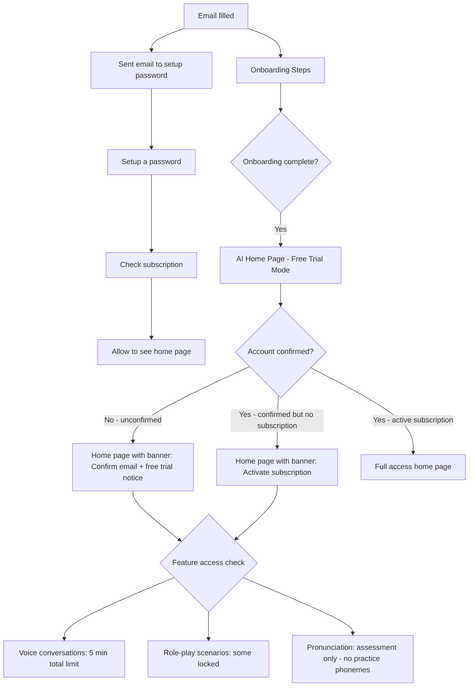

# Free Trial Flow — Updated User Journey

## Overview

This plan updates the user flow so that new users who complete onboarding but have **not yet confirmed their email / set up a password** are allowed to try the app with limited access, instead of being immediately shown a paywall.

---

## Current Flow (from the image — crossed-out paywall)

```
Email filled → Onboarding → [PAYWALL ❌] → AI Home Page
```

The paywall is being **removed** from the post-onboarding redirect.

---

## New Flow



---

## User States & Access Levels

| State | Voice Minutes | Role-plays | Pronunciation | Banner |
|---|---|---|---|---|
| Active subscription | Unlimited / plan limit | All unlocked | Full access | None |
| Confirmed email, no subscription | 5 min total | Some locked | Assessment only | Activate subscription |
| Unconfirmed email, no subscription | 5 min total | Some locked | Assessment only | Confirm email + activate |
| Anonymous (no email) | Redirect to login | — | — | — |

---

## Implementation Plan

### 1. Database Migration — Track Free Trial Usage

**File:** New Supabase migration

Add a column to `profiles` table to track free trial voice seconds used:

```sql
ALTER TABLE profiles 
ADD COLUMN IF NOT EXISTS free_trial_voice_seconds_used INTEGER DEFAULT 0,
ADD COLUMN IF NOT EXISTS free_trial_started_at TIMESTAMPTZ DEFAULT NOW();
```

This allows tracking cumulative voice usage across sessions for free-trial users.

---

### 2. New Hook: `useFreeTrial`

**File:** `ai-chat-app/src/hooks/useFreeTrial.ts`

```typescript
interface FreeTrialState {
  isFreeTrial: boolean;           // true if no active subscription
  isEmailConfirmed: boolean;      // true if email_confirmed_at is set
  voiceSecondsUsed: number;       // from profiles.free_trial_voice_seconds_used
  voiceSecondsLimit: number;      // 300 (5 minutes)
  voiceSecondsRemaining: number;  // limit - used
  canStartVoiceSession: boolean;  // remaining > 0
  canAccessPronunciationPractice: boolean; // false for free trial
  lockedCategories: string[];     // categories locked for free trial
}
```

**Logic:**
- Reads `hasActiveSubscription` from `useSubscription`
- Reads `email_confirmed_at` from Supabase auth user
- Reads `free_trial_voice_seconds_used` from `profiles` table
- Returns computed access flags

---

### 3. New Component: `FreeTrialBanner`

**File:** `ai-chat-app/src/components/FreeTrialBanner.tsx`

Two variants based on account state:

**Variant A — Unconfirmed email:**
```
🔔 Confirm your email to start improving your English
   [5:00 remaining] • [Confirm Email] [Activate Subscription]
```

**Variant B — Confirmed but no subscription:**
```
⭐ Activate subscription to start improving your English
   [5:00 remaining] • [See Plans]
```

**Features:**
- Sticky banner at top of home page
- Shows remaining free trial voice time as countdown
- CTA button navigates to existing `/subscription-plans` page (`SubscriptionPlans.tsx`)
- Secondary CTA to confirm email (if unconfirmed)
- Dismissible per session (but reappears on next visit)

---

### 4. Update `OnboardingPreferences.tsx`

**File:** `ai-chat-app/src/pages/onboarding/OnboardingPreferences.tsx`

**Change:** In `handleComplete()`, replace:
```typescript
navigate('/subscription-plans');
```
with:
```typescript
navigate('/ai-chat');  // Go directly to app in free trial mode
```

This is the key change that removes the paywall from the post-onboarding flow.

---

### 5. Update `OnboardingResumeHandler.tsx`

**File:** `ai-chat-app/src/components/OnboardingResumeHandler.tsx`

**Change:** When a user has completed onboarding but has no active subscription, allow them to reach `/ai-chat` instead of redirecting to subscription plans.

Remove any logic that redirects post-onboarding users to `/subscription-plans`.

---

### 6. New Hook: `useVoiceTimeLimit`

**File:** `ai-chat-app/src/hooks/useVoiceTimeLimit.ts`

Tracks and enforces the 5-minute free trial voice limit:

```typescript
interface VoiceTimeLimitState {
  isLimited: boolean;
  secondsRemaining: number;
  hasExceededLimit: boolean;
  recordUsage: (seconds: number) => Promise<void>;
}
```

**Logic:**
- For subscribed users: delegates to `useSubscription` limits
- For free-trial users: reads/writes `profiles.free_trial_voice_seconds_used`
- `recordUsage()` updates the database after each voice session ends

---

### 7. Update `AIChatVoice.tsx`

**File:** `ai-chat-app/src/pages/AIChatVoice.tsx`

**Changes:**
1. Import `useFreeTrial` hook
2. Before starting a voice session, check `canStartVoiceSession`
3. If limit reached, show upgrade modal instead of starting session
4. During session, track elapsed time and auto-end session when limit reached
5. After session ends, call `recordUsage(sessionDurationSeconds)`

**Upgrade modal content:**
```
You've used your 5 free minutes!
Activate a subscription to continue practicing.
[See Plans] [Maybe Later]
```

---

### 8. Update `RolePlaysV2.tsx`

**File:** `ai-chat-app/src/pages/RolePlaysV2.tsx`

**Changes:**
1. Import `useFreeTrial` hook
2. Define locked categories for free-trial users (e.g., `['Business', 'Interview', 'Dating']` — keep `Daily Life` and `Social` open)
3. Render a lock overlay on locked scenario cards
4. Show upgrade prompt when user taps a locked scenario

**Locked categories for free trial:**
- Business
- Interview  
- Dating
- Travel

**Unlocked for free trial:**
- Daily Life
- Social

---

### 9. Update `PronunciationPractice.tsx`

**File:** `ai-chat-app/src/pages/PronunciationPractice.tsx`

**Changes:**
1. Import `useFreeTrial` hook
2. If `isFreeTrial`, show only the baseline assessment section
3. Lock the "Practice" tab / phoneme practice sections
4. Show upgrade prompt when user tries to access practice phonemes

**UI change:**
- Practice tab shows lock icon with "Activate subscription to practice specific sounds"
- Baseline assessment remains fully accessible

---

### 10. Update `AIChatHome.tsx`

**File:** `ai-chat-app/src/pages/AIChatHome.tsx`

**Changes:**
1. Import `useFreeTrial` hook and `FreeTrialBanner` component
2. Render `<FreeTrialBanner />` at the top of the page when `isFreeTrial === true`
3. The banner is positioned below the header, above the main content

---

## File Change Summary

| File | Change Type | Description |
|---|---|---|
| `supabase/migrations/` | New | Add `free_trial_voice_seconds_used` column to profiles |
| `src/hooks/useFreeTrial.ts` | New | Hook for free trial state management |
| `src/hooks/useVoiceTimeLimit.ts` | New | Hook for voice time tracking/enforcement |
| `src/components/FreeTrialBanner.tsx` | New | Banner component with CTA |
| `src/pages/onboarding/OnboardingPreferences.tsx` | Modified | Redirect to `/ai-chat` not `/subscription-plans` |
| `src/components/OnboardingResumeHandler.tsx` | Modified | Remove post-onboarding paywall redirect |
| `src/pages/AIChatVoice.tsx` | Modified | Enforce 5-min limit, show upgrade modal |
| `src/pages/RolePlaysV2.tsx` | Modified | Lock certain categories for free trial |
| `src/pages/PronunciationPractice.tsx` | Modified | Lock practice phonemes, assessment only |
| `src/pages/AIChatHome.tsx` | Modified | Show FreeTrialBanner |

---

## Free Trial Limits Summary

| Feature | Free Trial Limit |
|---|---|
| Voice conversation time | 5 minutes total (cumulative across sessions) |
| Role-play categories | Daily Life + Social only (Business, Interview, Dating, Travel locked) |
| Pronunciation | Baseline assessment only (no phoneme practice) |
| Text chat | Unlimited (no restriction) |
| Vocabulary builder | Unlimited (no restriction) |

---

## Banner Design Spec

### Unconfirmed Email Banner
```
┌─────────────────────────────────────────────────────┐
│ 📧 Confirm your email to unlock full access          │
│    ⏱ 4:32 free minutes remaining                    │
│    [Confirm Email]  [Activate Subscription →]        │
└─────────────────────────────────────────────────────┘
```

### No Subscription Banner (email confirmed)
```
┌─────────────────────────────────────────────────────┐
│ ⭐ Activate subscription to start improving English  │
│    ⏱ 4:32 free minutes remaining                    │
│    [See Plans →]                                     │
└─────────────────────────────────────────────────────┘
```

---

## Key Design Decisions

1. **No paywall gate** — Users can enter the app after onboarding without paying
2. **Soft limits** — Limits are enforced gracefully with upgrade prompts, not hard blocks
3. **Cumulative tracking** — The 5-minute voice limit is cumulative across all sessions (stored in DB)
4. **Email confirmation** — Shown as a secondary CTA, not a blocker
5. **Assessment preserved** — Pronunciation baseline assessment is always available (it's part of onboarding value)
6. **Text chat unlimited** — No limit on text conversations to keep engagement high
