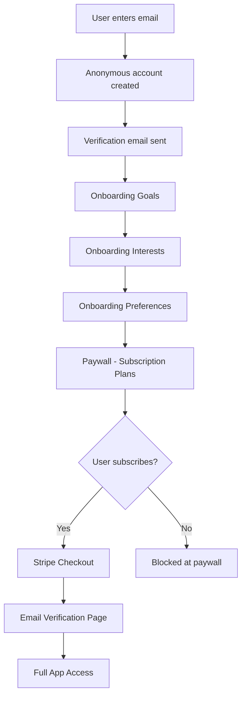
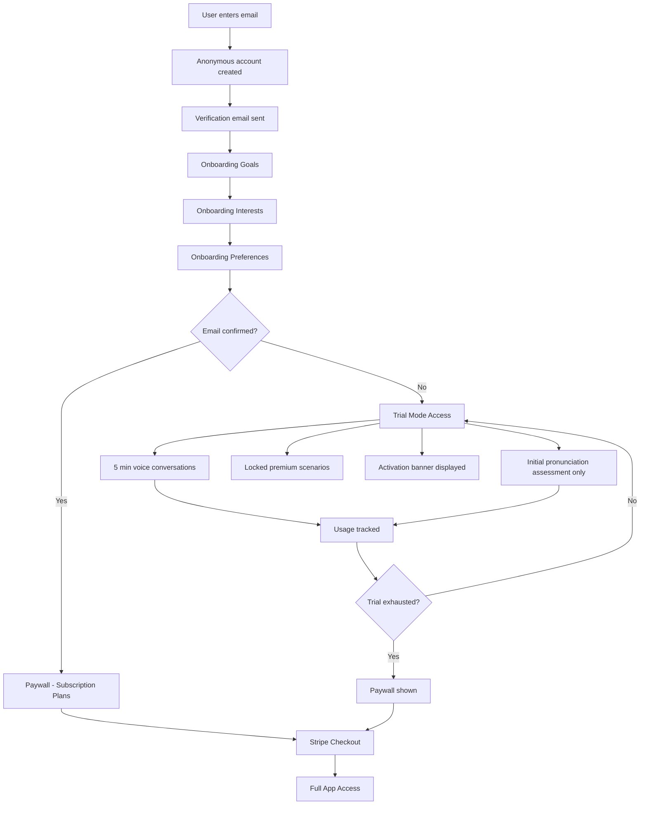

# Trial Mode Implementation Plan

## Overview

Allow users who completed onboarding but did not confirm email (setup password) to try the app with limitations before hitting the paywall. This creates a "try before you buy" experience that can increase conversion rates.

## Current Flow Analysis

### Existing User Journey



### Problem with Current Flow
- Users hit paywall immediately after onboarding
- No opportunity to experience the app value
- Users who didnt confirm email have no access
- High friction before value demonstration

## Proposed New Flow



## Trial Mode Limitations

### 1. Voice Conversation Time Limit
- **Total limit**: 5 minutes of conversation time
- **Tracking**: Cumulative across all sessions
- **Enforcement**: Block new sessions when limit reached
- **UI**: Show remaining time in banner

### 2. Scenario Restrictions
- **Locked scenarios**: Premium role-play scenarios
- **Unlocked scenarios**: Basic conversation practice
- **Implementation**: Add `is_premium` flag to agents table
- **UI**: Show lock icon on premium scenarios

### 3. Pronunciation Features
- **Allowed**: Initial pronunciation assessment
- **Locked**: Phoneme practice sessions
- **Locked**: Targeted practice exercises
- **Locked**: Progress tracking dashboard
- **UI**: Show upgrade prompt when accessing locked features

### 4. Activation Banner
- Display persistent banner: "Activate your subscription to start improving your English"
- Show remaining trial time
- Include CTA button to subscription page

## Technical Implementation

### Database Schema Changes

#### New Table: `justai_trial_usage`
```sql
CREATE TABLE justai_trial_usage (
    id UUID PRIMARY KEY DEFAULT gen_random_uuid(),
    student_id UUID REFERENCES profiles(id) ON DELETE CASCADE,
    voice_seconds_used INTEGER DEFAULT 0,
    assessment_completed BOOLEAN DEFAULT false,
    created_at TIMESTAMPTZ DEFAULT now(),
    updated_at TIMESTAMPTZ DEFAULT now(),
    UNIQUE(student_id)
);

-- Index for quick lookups
CREATE INDEX idx_trial_usage_student ON justai_trial_usage(student_id);
```

#### New Column: `is_premium` on agents table
```sql
ALTER TABLE agents ADD COLUMN is_premium BOOLEAN DEFAULT false;

-- Update existing agents
UPDATE agents SET is_premium = true 
WHERE category IN ('interview', 'dating', 'business');
```

#### New Column: `trial_mode` on profiles
```sql
ALTER TABLE profiles ADD COLUMN trial_mode BOOLEAN DEFAULT false;
ALTER TABLE profiles ADD COLUMN trial_started_at TIMESTAMPTZ;
```

### Frontend Changes

#### 1. New Hook: `useTrialMode.ts`
```typescript
interface TrialAccess {
  isInTrialMode: boolean;
  voiceSecondsRemaining: number;
  voiceMinutesLimit: number;
  hasAssessmentAccess: boolean;
  canStartVoiceSession: boolean;
  isScenarioLocked: (scenarioId: string) => boolean;
  trackVoiceUsage: (seconds: number) => Promise<void>;
  trialPercentage: number;
}
```

#### 2. Modified Component: `OnboardingPreferences.tsx`
- After onboarding completion, check email confirmation status
- If not confirmed, set `trial_mode = true` and redirect to `/ai-chat`
- If confirmed, redirect to `/subscription-plans`

#### 3. New Component: `TrialActivationBanner.tsx`
- Persistent banner at top of app
- Shows remaining trial time
- CTA to activate subscription
- Dismissible but shows again after navigation

#### 4. Modified Component: `AIChatVoice.tsx`
- Check trial limits before starting session
- Track voice usage in real-time
- Show warning when approaching limit
- Block session when limit reached

#### 5. Modified Component: `RolePlaysV2.tsx`
- Check `is_premium` flag for each scenario
- Show lock icon on premium scenarios
- Show upgrade modal when clicking locked scenario

#### 6. Modified Component: `PronunciationPractice.tsx`
- Allow initial assessment only
- Lock practice sessions
- Show upgrade prompt for locked features

#### 7. Modified Component: `ProtectedRoute.tsx`
- Allow access for trial mode users
- Check `trial_mode` flag in profile

### Backend Changes

#### 1. Edge Function: `track-trial-usage`
- Track voice seconds used
- Update `justai_trial_usage` table
- Return remaining time

#### 2. Edge Function: `check-trial-access`
- Check if user has trial access
- Return remaining limits
- Check if features are accessible

#### 3. Database Function: `get_trial_status`
```sql
CREATE OR REPLACE FUNCTION get_trial_status(p_student_id UUID)
RETURNS TABLE(
    is_trial_mode BOOLEAN,
    voice_seconds_remaining INTEGER,
    assessment_completed BOOLEAN
) AS $$
BEGIN
    RETURN QUERY
    SELECT 
        p.trial_mode,
        (300 - COALESCE(t.voice_seconds_used, 0))::INTEGER,
        COALESCE(t.assessment_completed, false)
    FROM profiles p
    LEFT JOIN justai_trial_usage t ON t.student_id = p.id
    WHERE p.id = p_student_id;
END;
$$ LANGUAGE plpgsql;
```

### State Management

#### New State: Trial Mode State
```typescript
interface TrialState {
  isInTrialMode: boolean;
  voiceSecondsUsed: number;
  voiceSecondsLimit: number; // 300 seconds = 5 minutes
  assessmentCompleted: boolean;
  trialStartedAt: Date | null;
}
```

#### LocalStorage Key: `justai_trial_state`
- Persist trial state across sessions
- Sync with database on auth events

## User Experience Flow

### Trial Mode Entry
1. User completes onboarding
2. System checks email confirmation status
3. If not confirmed, trial mode activated
4. User redirected to main app with trial banner

### Trial Mode Experience
1. Banner shows: "5:00 remaining - Activate subscription to unlock full access"
2. User can start voice conversations
3. Timer counts down during conversations
4. User can complete initial pronunciation assessment
5. Premium scenarios show lock icon
6. Practice features show upgrade prompt

### Trial Mode Exit
1. When 5 minutes exhausted, show paywall
2. User must subscribe to continue
3. Trial state preserved for conversion tracking

### Conversion Path
1. User clicks "Activate Subscription" in banner
2. Redirected to `/subscription-plans`
3. After subscription, trial mode disabled
4. Full access granted

## Implementation Checklist

### Phase 1: Database Setup
- [ ] Create `justai_trial_usage` table
- [ ] Add `is_premium` column to agents
- [ ] Add `trial_mode` columns to profiles
- [ ] Create database functions for trial status

### Phase 2: Backend Implementation
- [ ] Create `track-trial-usage` edge function
- [ ] Create `check-trial-access` edge function
- [ ] Update existing voice session endpoints

### Phase 3: Frontend Core
- [ ] Create `useTrialMode` hook
- [ ] Create `TrialActivationBanner` component
- [ ] Update `ProtectedRoute` for trial access

### Phase 4: Feature Integration
- [ ] Update `AIChatVoice` with trial limits
- [ ] Update `RolePlaysV2` with scenario locks
- [ ] Update `PronunciationPractice` with feature locks
- [ ] Update `OnboardingPreferences` flow

### Phase 5: Testing
- [ ] Test trial mode activation
- [ ] Test voice time tracking
- [ ] Test scenario locking
- [ ] Test pronunciation feature locking
- [ ] Test conversion flow

## Analytics Events

### New Events to Track
- `trial_mode_activated` - When user enters trial mode
- `trial_voice_session_started` - Voice session in trial
- `trial_voice_seconds_used` - Cumulative usage
- `trial_limit_reached` - When 5 min exhausted
- `trial_scenario_locked` - Click on locked scenario
- `trial_feature_locked` - Click on locked feature
- `trial_banner_clicked` - CTA click on banner
- `trial_converted` - Subscription after trial

## Risk Considerations

### Abuse Prevention
- Trial tied to device fingerprint
- Email required before trial
- Rate limiting on trial creation
- Monitor for abuse patterns

### User Experience
- Clear communication of limits
- Graceful degradation
- Easy path to subscription
- Preserve progress after subscription

## Success Metrics

### Primary Metrics
- Trial to subscription conversion rate
- Time to first subscription
- User engagement during trial

### Secondary Metrics
- Feature usage during trial
- Scenario completion rates
- Pronunciation assessment completion
- Banner CTA click rate

## Timeline Estimate

| Phase | Description |
|-------|-------------|
| Phase 1 | Database schema changes |
| Phase 2 | Backend edge functions |
| Phase 3 | Frontend core components |
| Phase 4 | Feature integration |
| Phase 5 | Testing and QA |

## Questions for Clarification

1. Should the 5-minute limit be per session or total?
2. Which specific scenarios should be locked vs unlocked?
3. Should trial users have access to vocabulary builder?
4. Should we show a countdown timer during voice sessions?
5. What happens if user confirms email during trial - immediate paywall or continue trial?
