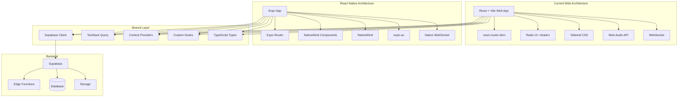
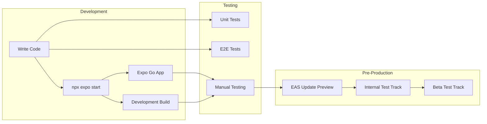

# Expo/React Native Migration Feasibility Analysis

## Executive Summary

This document provides a comprehensive analysis of migrating the JustTalk AI application from React + Vite (web) to Expo (React Native) for mobile devices. The analysis covers dependency compatibility, state management portability, UI/CSS translation requirements, and provides a strategic migration roadmap.

**Overall Feasibility: MODERATE-HIGH** with significant architectural considerations.

---

## 1. Current Application Architecture Overview

### 1.1 Technology Stack

| Category | Current Technology | React Native Alternative |
|----------|-------------------|-------------------------|
| Framework | React 19 + Vite | Expo SDK 52+ |
| Routing | react-router-dom v7 | Expo Router (file-based) |
| State Management | React Context + TanStack Query v5 | Same (compatible) |
| UI Components | Radix UI + shadcn/ui | React Native Paper / Tamagui / NativeWind |
| Styling | Tailwind CSS v3 | NativeWind v2+ (Tailwind for RN) |
| Backend | Supabase | Supabase (compatible) |
| Audio | Web Audio API + MediaRecorder | expo-av / react-native-audio-api |

### 1.2 Application Structure

```
ai-chat-app/src/
├── components/          # 30+ components
│   ├── ui/             # 20 shadcn/ui components
│   ├── pronunciation/  # 7 pronunciation components
│   └── vocabulary/     # 9 vocabulary components
├── pages/              # 25+ page components
├── hooks/              # 15+ custom hooks
├── contexts/           # AuthContext
├── lib/                # API utilities, audio recorder
├── services/           # API services
└── types/              # TypeScript definitions
```

---

## 2. Dependency Compatibility Analysis

### 2.1 Fully Compatible Dependencies ✅

These dependencies work in both web and React Native with minimal changes:

| Dependency | Version | Notes |
|------------|---------|-------|
| `@supabase/supabase-js` | ^2.86.2 | Full React Native support |
| `@tanstack/react-query` | ^5.90.10 | Fully compatible |
| `date-fns` | ^4.1.0 | Tree-shakeable, works everywhere |
| `openai` | ^4.76.0 | Node.js compatible, works in RN |
| `clsx` | ^2.1.1 | Utility library, compatible |
| `tailwind-merge` | ^3.4.0 | Works with NativeWind |

### 2.2 Dependencies Requiring Alternatives ⚠️

| Current Dependency | React Native Alternative | Migration Complexity |
|-------------------|------------------------|---------------------|
| `react-router-dom` | `expo-router` | **HIGH** - Complete routing rewrite |
| `@radix-ui/*` | `react-native-paper` / Tamagui | **HIGH** - All UI components need replacement |
| `lucide-react` | `lucide-react-native` | **LOW** - Same icon library, RN version exists |
| `motion` (framer-motion) | `react-native-reanimated` | **MEDIUM** - Different API, similar concepts |
| `sonner` (toast) | `react-native-toast-message` | **LOW** - Simple replacement |
| `vaul` (drawer) | Native drawer implementations | **MEDIUM** |

### 2.3 Dependencies Requiring Complete Rewrite ❌

| Current Dependency | Issue | Solution |
|-------------------|-------|----------|
| `@elevenlabs/react` | Web WebSocket implementation | Use ElevenLabs REST API or native WebSocket |
| `@react-three/fiber` | WebGL not available | Remove 3D effects or use react-three-fiber native (limited) |
| `@shadergradient/react` | WebGL shaders | Remove or create native animations |
| `three` | WebGL dependency | Remove 3D background effects |
| `react-easy-crop` | Web canvas-based | Use `react-native-image-crop-picker` |
| `@stripe/react-stripe-js` | Web Stripe Elements | Use `@stripe/stripe-react-native` |
| `posthog-js` | Web analytics | Use `posthog-react-native` |

### 2.4 Web-Specific APIs Requiring Native Replacements

| Web API | Current Usage | React Native Alternative |
|---------|--------------|-------------------------|
| `navigator.mediaDevices.getUserMedia` | Audio recording | `expo-av` Audio recording API |
| `MediaRecorder` | Voice recording | `expo-av` or `react-native-audio-api` |
| `AudioContext` | Audio processing | `expo-audio` / `react-native-audio-api` |
| `localStorage` | Session persistence | `@react-native-async-storage/async-storage` |
| `document.cookie` | Sidebar state | AsyncStorage |
| `window` / DOM operations | Viewport, scrolling | React Native Dimensions, ScrollView |

---

## 3. State Management Portability Assessment

### 3.1 AuthContext Analysis

**File:** [`src/contexts/AuthContext.tsx`](ai-chat-app/src/contexts/AuthContext.tsx)

**Portability: HIGH** ✅

The authentication context uses:
- React `createContext` and `useContext` - ✅ Compatible
- `useState` and `useEffect` - ✅ Compatible
- Supabase auth methods - ✅ Compatible
- `localStorage` for onboarding email - ⚠️ Needs AsyncStorage

**Required Changes:**
```typescript
// Web (current)
localStorage.removeItem('justai_onboarding_email');

// React Native (replacement)
import AsyncStorage from '@react-native-async-storage/async-storage';
await AsyncStorage.removeItem('justai_onboarding_email');
```

### 3.2 React Query Hooks Analysis

**Files:** [`src/hooks/useVocabularyBuilder.ts`](ai-chat-app/src/hooks/useVocabularyBuilder.ts), [`src/hooks/useSubscription.ts`](ai-chat-app/src/hooks/useSubscription.ts)

**Portability: EXCELLENT** ✅

All TanStack Query patterns are fully compatible:
- `useQuery` - ✅ Compatible
- `useMutation` - ✅ Compatible
- `useQueryClient` - ✅ Compatible
- Query invalidation patterns - ✅ Compatible

**No changes required** for the query logic itself.

### 3.3 Custom Hooks Assessment

| Hook | Portability | Notes |
|------|-------------|-------|
| `useSession` | ✅ High | Uses Supabase auth |
| `useSubscription` | ✅ High | React Query based |
| `useVocabularyBuilder` | ✅ High | React Query based |
| `useFocusSet` | ✅ High | React Query based |
| `use-mobile` | ⚠️ Medium | Uses `window.matchMedia` - needs native detection |
| `useSwipeGesture` | ⚠️ Medium | Uses web touch events - needs React Native Gesture Handler |

---

## 4. UI Component Migration Analysis

### 4.1 shadcn/ui Components Inventory

The application uses 20+ shadcn/ui components built on Radix UI primitives:

| Component | Complexity | Native Alternative |
|-----------|------------|-------------------|
| `Button` | Low | Custom with NativeWind or Tamagui |
| `Input` | Low | React Native TextInput + NativeWind |
| `Card` | Low | Custom View with NativeWind |
| `Avatar` | Low | React Native Image with styling |
| `Badge` | Low | Custom Text with NativeWind |
| `Dialog` | Medium | React Native Modal |
| `Drawer` | Medium | `react-native-drawer` or custom |
| `Sheet` | Medium | React Native Modal or `react-native-sheet` |
| `Select` | Medium | React Native Picker or custom |
| `DropdownMenu` | Medium | React Native Modal with FlatList |
| `Tabs` | Medium | Custom with React Native Animated |
| `Slider` | Medium | `@react-native-community/slider` |
| `Progress` | Low | Custom Animated.View |
| `Skeleton` | Low | Custom Animated.View |
| `Sidebar` | High | Navigation drawer pattern |
| `Carousel` | Medium | `react-native-reanimated-carousel` |
| `Tooltip` | Low | React Native Modal with positioning |
| `Checkbox` | Low | Custom or react-native-checkbox |
| `Label` | Low | React Native Text |
| `Separator` | Low | React Native View with border |

### 4.2 Component Migration Strategy

**Option A: NativeWind (Recommended)**
- Use Tailwind CSS syntax with React Native
- Maintain similar styling patterns
- Lower learning curve for team

**Option B: Tamagui**
- Full UI kit with components
- Better performance (compiled styles)
- Higher learning curve

**Option C: React Native Paper**
- Material Design components
- Production-ready components
- Different visual language

### 4.3 Complex Components Analysis

#### FeedbackDrawer Component
**File:** [`src/components/FeedbackDrawer.tsx`](ai-chat-app/src/components/FeedbackDrawer.tsx)

**Migration Complexity: MEDIUM**

Key features to migrate:
- Tab-based navigation within drawer
- Animated loading states
- Card-based content display
- Badge components

**Native approach:**
```tsx
// Use react-native-reanimated for animations
import Animated, { FadeIn, SlideInDown } from 'react-native-reanimated';

// Use react-native-modal for drawer
import Modal from 'react-native-modal';
```

#### AppSidebar Component
**File:** [`src/components/AppSidebar.tsx`](ai-chat-app/src/components/AppSidebar.tsx)

**Migration Complexity: HIGH**

Current implementation:
- Uses Sheet component for mobile
- Cookie-based state persistence
- Complex navigation structure

**Native approach:**
- Use `@react-navigation/drawer` or Expo Router nested navigation
- Replace with tab-based navigation for mobile UX

---

## 5. CSS/Styling Migration Assessment

### 5.1 Current Tailwind Configuration

**File:** [`tailwind.config.js`](ai-chat-app/tailwind.config.js)

The application uses:
- CSS custom properties for theming
- Custom color palette (sidebar, brand colors)
- Custom font families (Inter Tight, DIN Round Pro)
- Corner shape plugin

### 5.2 CSS to NativeWind Translation

| CSS Feature | NativeWind Support |
|-------------|-------------------|
| Flexbox utilities | ✅ Full support |
| Grid utilities | ⚠️ Limited (RN doesn't support CSS Grid) |
| Padding/Margin | ✅ Full support |
| Colors | ✅ Full support |
| Typography | ✅ Full support |
| Shadows | ⚠️ Different syntax (iOS/Android specific) |
| Transitions | ⚠️ Use react-native-reanimated |
| Keyframe animations | ⚠️ Use react-native-reanimated |
| CSS Variables | ❌ Not supported - use theme constants |
| Pseudo-classes | ⚠️ Limited - use state-based styling |

### 5.3 Critical CSS Patterns Requiring Changes

**1. CSS Custom Properties (Not Supported)**
```css
/* Web (current) */
--background: 0 0% 100%;
--primary: 217 91% 60%;

/* React Native (replacement) */
export const colors = {
  background: '#FFFFFF',
  primary: '#3B82F6',
};
```

**2. CSS Grid (Not Supported)**
```css
/* Web (current) */
display: grid;
grid-template-columns: repeat(3, 1fr);

/* React Native (replacement) */
// Use Flexbox with wrap or react-native-masonry-list
<View style={{ flexDirection: 'row', flexWrap: 'wrap' }}>
  {items.map(item => (
    <View style={{ width: '33.33%' }}>...</View>
  ))}
</View>
```

**3. Complex Animations**
```css
/* Web (current) */
@keyframes pulse-glow {
  0%, 100% { box-shadow: 0 0 20px rgba(59, 130, 246, 0.5); }
  50% { box-shadow: 0 0 40px rgba(59, 130, 246, 0.8); }
}

/* React Native (replacement) */
import Animated, { useAnimatedStyle, withRepeat, withSequence } from 'react-native-reanimated';
```

---

## 6. Audio/Voice Feature Migration

### 6.1 Current Audio Implementation

**File:** [`src/lib/audioRecorder.ts`](ai-chat-app/src/lib/audioRecorder.ts)

The application uses:
- `MediaRecorder` API for recording
- `AudioContext` for processing
- WebCodecs for WAV conversion
- 16kHz mono PCM16 format for SpeechSuper API

### 6.2 React Native Audio Strategy

**Recommended Stack:**
- `expo-av` for basic recording
- `react-native-audio-api` for advanced processing
- Custom native module for WAV encoding (if needed)

**Migration Example:**
```typescript
// Web (current)
const mediaRecorder = new MediaRecorder(stream, { mimeType: 'audio/webm' });

// React Native (expo-av)
import { Audio } from 'expo-av';
const { recording } = await Audio.Recording.createAsync(
  Audio.RecordingOptionsPresets.HIGH_QUALITY
);
```

### 6.3 ElevenLabs Integration

**Current:** Uses `@elevenlabs/react` WebSocket-based conversation hook.

**React Native Options:**
1. **REST API polling** - Simpler but less real-time
2. **Native WebSocket** - More complex but maintains real-time
3. **ElevenLabs SDK for mobile** - If available

---

## 7. Routing Migration Strategy

### 7.1 Current Routing Structure

**File:** [`src/App.tsx`](ai-chat-app/src/App.tsx)

The app uses react-router-dom with:
- 30+ routes
- Protected routes wrapper
- Nested routes for onboarding
- Dynamic routes with parameters

### 7.2 Expo Router Migration

Expo Router uses file-based routing:

```
app/
├── _layout.tsx          # Root layout
├── index.tsx            # Home screen
├── (auth)/
│   ├── _layout.tsx
│   ├── login.tsx
│   └── signin.tsx
├── (main)/
│   ├── _layout.tsx      # Protected layout
│   ├── ai-chat/
│   │   ├── index.tsx
│   │   └── [id].tsx     # Dynamic route
│   ├── profile.tsx
│   └── settings.tsx
└── onboarding/
    ├── goals.tsx
    └── pronunciation.tsx
```

### 7.3 Route Mapping

| Current Route | Expo Router File |
|--------------|------------------|
| `/` | `app/index.tsx` |
| `/login` | `app/(auth)/login.tsx` |
| `/ai-chat` | `app/(main)/ai-chat/index.tsx` |
| `/ai-chat/conversation/:id` | `app/(main)/ai-chat/conversation/[id].tsx` |
| `/ai-chat/voice/:id` | `app/(main)/ai-chat/voice/[id].tsx` |
| `/onboarding/goals` | `app/onboarding/goals.tsx` |

---

## 8. Technical Roadblocks

### 8.1 Critical Blockers

| Blocker | Severity | Mitigation |
|---------|----------|------------|
| ElevenLabs WebSocket integration | HIGH | Build custom native WebSocket or use REST API |
| 3D background effects (Three.js) | MEDIUM | Replace with Lottie animations or remove |
| Stripe web checkout | MEDIUM | Use Stripe React Native SDK |
| SpeechSuper API integration | MEDIUM | Ensure audio format compatibility |

### 8.2 Moderate Challenges

| Challenge | Impact | Solution |
|-----------|--------|----------|
| Complex animations | Medium | Use react-native-reanimated |
| Sidebar navigation | Medium | Redesign for mobile UX |
| Image cropping | Low | Use react-native-image-crop-picker |
| Toast notifications | Low | Use react-native-toast-message |

### 8.3 Minor Issues

| Issue | Impact | Solution |
|-------|--------|----------|
| Font loading | Low | Use expo-font |
| SVG icons | Low | Use react-native-svg |
| Environment variables | Low | Use expo-constants |

---

## 9. Reusable Code Assets

### 9.1 Business Logic (90%+ Reusable)

- ✅ All React Query hooks
- ✅ Supabase client configuration
- ✅ API service functions
- ✅ Type definitions
- ✅ Utility functions (date formatting, etc.)
- ✅ Context providers (with AsyncStorage changes)

### 9.2 Partially Reusable (50-70%)

- ⚠️ Custom hooks (platform-specific APIs)
- ⚠️ Component logic (without JSX)
- ⚠️ Animation definitions (different syntax)

### 9.3 Not Reusable (Complete Rewrite)

- ❌ All UI component JSX
- ❌ CSS/Tailwind styles
- ❌ Routing configuration
- ❌ Audio recording implementation
- ❌ Platform-specific integrations

---

## 10. Strategic Migration Roadmap

### Phase 1: Foundation Setup

**Goal:** Establish Expo project with core infrastructure

**Tasks:**
1. Create new Expo project with TypeScript
2. Configure Expo Router for navigation
3. Set up NativeWind for styling
4. Configure Supabase client
5. Set up React Query provider
6. Implement AuthContext with AsyncStorage
7. Create base layout components
8. Configure expo-font for custom fonts

**Deliverables:**
- Working Expo app skeleton
- Authentication flow functional
- Navigation structure in place

### Phase 2: Core UI Components

**Goal:** Build reusable component library

**Tasks:**
1. Create Button component with variants
2. Create Input/TextInput component
3. Create Card component
4. Create Avatar component
5. Create Badge component
6. Create Modal/Dialog component
7. Create Loading/Skeleton components
8. Create Tab navigation component

**Deliverables:**
- Component library matching design system
- Storybook/documentation for components

### Phase 3: Authentication & Onboarding

**Goal:** Migrate auth flows and onboarding screens

**Tasks:**
1. Migrate Login page
2. Migrate SignIn page
3. Migrate ForgotPassword page
4. Migrate EmailVerification page
5. Migrate AuthCallback page
6. Migrate SetupPassword page
7. Migrate OnboardingGoals page
8. Migrate OnboardingInterests page
9. Migrate OnboardingPreferences page
10. Migrate PronunciationAssessment page

**Deliverables:**
- Complete authentication flow
- Onboarding sequence functional

### Phase 4: Main Application Screens

**Goal:** Migrate core app functionality

**Tasks:**
1. Migrate AIChatHome page
2. Migrate AIChatConversation page
3. Migrate AIChatVoice page (with audio integration)
4. Migrate RolePlays page
5. Migrate VocabularyBuilder page
6. Migrate Profile page
7. Migrate Settings page
8. Migrate SubscriptionPlans page
9. Migrate SubscriptionStatus page

**Deliverables:**
- Core application features functional
- Navigation between screens working

### Phase 5: Audio & Voice Integration

**Goal:** Implement voice conversation features

**Tasks:**
1. Integrate expo-av for audio recording
2. Implement WAV encoding if needed
3. Build ElevenLabs WebSocket integration
4. Implement SpeechSuper API integration
5. Create voice UI components
6. Implement real-time transcription display

**Deliverables:**
- Voice conversation feature working
- Audio recording and playback functional

### Phase 6: Subscription & Payments

**Goal:** Implement payment flows

**Tasks:**
1. Integrate Stripe React Native SDK
2. Migrate subscription management
3. Implement checkout flow
4. Add receipt validation
5. Test subscription flows

**Deliverables:**
- Complete payment flow
- Subscription management working

### Phase 7: Polish & Optimization

**Goal:** Final refinements and performance

**Tasks:**
1. Implement animations with react-native-reanimated
2. Add haptic feedback
3. Optimize bundle size
4. Implement offline support
5. Add error boundaries
6. Performance profiling
7. Accessibility improvements

**Deliverables:**
- Production-ready mobile app
- Performance optimized

### Phase 8: Testing & Launch

**Goal:** Quality assurance and deployment

**Tasks:**
1. Write unit tests for critical paths
2. Write integration tests
3. Test on iOS and Android
4. Configure EAS Build
5. Set up OTA updates
6. App store submission
7. Play store submission

**Deliverables:**
- Apps published to stores
- CI/CD pipeline configured

---

## 11. Architecture Diagram



---

## 12. Effort Estimation Summary

| Category | Components/Files | Complexity | Notes |
|----------|-----------------|------------|-------|
| Project Setup | 1 | Low | Expo init + configuration |
| Routing Migration | 30+ routes | High | Complete rewrite with Expo Router |
| UI Components | 30+ | High | All need native versions |
| Hooks Migration | 15+ | Medium | Mostly compatible |
| Audio System | 3 files | High | Complete rewrite |
| State Management | 5 files | Low | Minimal changes |
| API Integration | 10+ files | Low | Mostly compatible |
| Styling | All components | High | NativeWind conversion |
| Testing | All | Medium | New test suite needed |

---

## 13. Recommendations

### 13.1 Recommended Technology Stack

| Category | Recommendation | Rationale |
|----------|---------------|-----------|
| Framework | Expo SDK 52+ | Best DX, OTA updates, managed workflow |
| Navigation | Expo Router | File-based, type-safe, deep linking |
| Styling | NativeWind v2+ | Maintains Tailwind patterns |
| Animations | react-native-reanimated | Best performance, worklet-based |
| Audio | expo-av + custom modules | Proven, well-documented |
| State | TanStack Query + Context | Already in use, compatible |
| UI Components | Custom with NativeWind | Maintain design consistency |

### 13.2 Alternative Considerations

**If performance is critical:**
- Consider Tamagui for compiled styles
- Use Fabric architecture (new architecture)

**If development speed is priority:**
- Use React Native Paper for ready components
- Accept Material Design visual language

### 13.3 Risk Mitigation

1. **Proof of Concept First**
   - Build voice recording POC before full migration
   - Test ElevenLabs integration on native

2. **Incremental Migration**
   - Keep web app running during migration
   - Feature parity tracking

3. **Fallback Plans**
   - REST API fallback for WebSocket features
   - Simplified animations if performance issues

---

## 14. Development & Testing Workflow

### 14.1 Local Development Options

Expo provides multiple ways to run and test your app during development without building for stores:

#### Option A: Expo Go (Fastest for Development)

```bash
# Install Expo CLI
npm install -g expo-cli

# Start development server
npx expo start

# Scan QR code with Expo Go app (iOS/Android)
```

**Pros:**
- Instant reload on changes
- No build required
- Test on physical device immediately
- Works on both iOS and Android

**Limitations:**
- Cannot test custom native modules
- Limited to Expo SDK capabilities
- Some audio features may need custom development client

#### Option B: Expo Development Build (Recommended for This Project)

Since the app uses audio recording and may need custom native code:

```bash
# Create development build
npx expo install expo-dev-client

# Build for local testing (requires EAS account)
eas build --profile development --platform ios --local
eas build --profile development --platform android --local

# Or use simulators
npx expo run:ios
npx expo run:android
```

**Pros:**
- Full native capabilities
- Custom native modules work
- Closer to production build
- Can test audio features properly

#### Option C: iOS Simulator / Android Emulator

```bash
# iOS Simulator (macOS only)
npx expo run:ios

# Android Emulator
npx expo run:android
```

**Requirements:**
- Xcode (iOS) or Android Studio (Android)
- Properly configured simulators/emulators

### 14.2 Testing Workflow During Migration



### 14.3 EAS Update for Over-the-Air Testing

Expo's EAS Update allows you to push updates without rebuilding:

```bash
# Configure EAS Update
eas update:configure

# Push an update to testers
eas update --branch preview --message "Test new feature"

# Testers with the app get the update automatically
```

**Use Cases:**
- Quick bug fixes during testing
- A/B testing features
- Beta testing without app store review

### 14.4 Testing Environments

| Environment | Purpose | How to Access |
|-------------|---------|---------------|
| Development | Active coding | Expo Go or Dev Client |
| Preview | Stakeholder review | EAS Update preview branch |
| Staging | QA testing | Internal TestFlight / Play Console |
| Production | Live users | App Store / Play Store |

### 14.5 Setting Up TestFlight and Play Console Internal Testing

#### iOS TestFlight Setup

1. **Create App Store Connect App**
   ```bash
   eas app:create --platform ios
   ```

2. **Build and Submit**
   ```bash
   eas build --platform ios --profile preview
   eas submit --platform ios --latest
   ```

3. **Add Internal Testers**
   - Go to App Store Connect
   - Navigate to TestFlight → Internal Testing
   - Add up to 100 testers by email

4. **Testers Install via TestFlight App**

#### Android Internal Testing Setup

1. **Create Play Console App**
   ```bash
   eas app:create --platform android
   ```

2. **Build and Submit**
   ```bash
   eas build --platform android --profile preview
   eas submit --platform android --latest
   ```

3. **Create Internal Testing Track**
   - Go to Play Console
   - Navigate to Testing → Internal testing
   - Add tester emails (up to 100)

4. **Testers Join via Play Store Link**

### 14.6 Recommended Testing Strategy

#### Phase 1: Development Testing
```bash
# Daily development
npx expo start

# Test on your device with Expo Go
# Or use development build for audio features
npx expo run:ios --device
```

#### Phase 2: Feature Testing
```bash
# Create preview build for specific feature
eas build --profile preview --platform all

# Share with team via EAS Update
eas update --branch preview --message "Voice feature test"
```

#### Phase 3: Beta Testing
```bash
# Build for TestFlight and Play Console
eas build --profile preview --platform ios
eas build --profile preview --platform android

# Submit to stores
eas submit --platform ios --latest
eas submit --platform android --latest
```

### 14.7 EAS Configuration for Testing

Create `eas.json` in your project root:

```json
{
  "cli": {
    "version": ">= 5.0.0"
  },
  "build": {
    "development": {
      "developmentClient": true,
      "distribution": "internal",
      "ios": {
        "simulator": true
      }
    },
    "preview": {
      "distribution": "internal",
      "ios": {
        "simulator": false
      },
      "android": {
        "buildType": "apk"
      }
    },
    "production": {
      "ios": {
        "autoIncrement": true
      },
      "android": {
        "buildType": "app-bundle"
      }
    }
  },
  "submit": {
    "production": {
      "ios": {
        "appleId": "your-apple-id@email.com",
        "ascAppId": "your-app-store-connect-app-id"
      },
      "android": {
        "serviceAccountKeyPath": "./google-services.json"
      }
    }
  }
}
```

### 14.8 Quick Testing Commands Reference

| Task | Command |
|------|---------|
| Start dev server | `npx expo start` |
| Run on iOS simulator | `npx expo run:ios` |
| Run on Android emulator | `npx expo run:android` |
| Run on connected device | `npx expo run:ios --device` |
| Build preview APK | `eas build --profile preview --platform android --local` |
| Build for TestFlight | `eas build --profile preview --platform ios` |
| Push OTA update | `eas update --branch preview` |
| View build logs | `eas build:list` |

### 14.9 Testing Audio Features

For audio recording testing specifically:

```bash
# Audio requires real device testing
npx expo run:ios --device
npx expo run:android --device

# Or use development build
eas build --profile development --platform ios --local
# Install the .ipa on your device via Xcode or Apple Configurator
```

**Note:** Audio recording cannot be fully tested in Expo Go due to native module limitations. Use development builds for audio feature testing.

---

## 15. Conclusion

The migration from React + Vite to Expo is **feasible** with moderate-to-high effort. The key advantages are:

**Pros:**
- Business logic is highly reusable (90%+)
- State management is fully compatible
- Supabase works seamlessly with React Native
- Modern Expo provides excellent DX

**Cons:**
- All UI components need rewriting
- Audio system requires complete rebuild
- Routing needs architectural change
- Some web-specific features need alternatives

**Estimated Timeline:** 3-4 months for full migration with a team of 2-3 developers.

**Recommendation:** Proceed with migration using the phased approach outlined above, starting with a proof of concept for the voice recording feature to validate the most critical technical risk.
