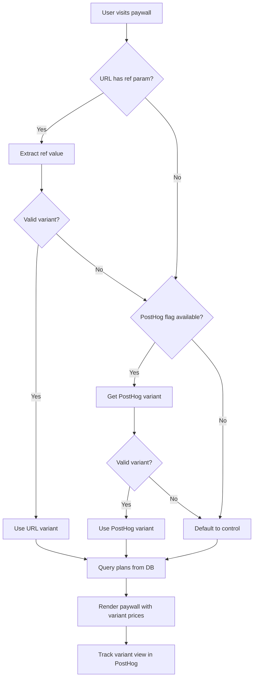

# Paywall A/B Test Implementation Plan

## Overview

Implement A/B testing for the subscription-plans (paywall) page using a hybrid approach:
1. **URL `ref` parameter** - Takes priority when user arrives from external landing page
2. **PostHog feature flag** - Fallback when no URL parameter is present

## Requirements Summary

| Source | Parameter | Priority | Use Case |
|--------|-----------|----------|----------|
| URL Parameter | `ref=plan-a`, `ref=plan-b`, `ref=control` | HIGH (1st) | External marketing landing page campaigns |
| PostHog Feature Flag | `pricing-test-landing` | LOW (2nd) | Organic traffic without campaign |

## Pricing Variants

| Variant | Basic Weekly | Basic Monthly | Basic Annual | Premium Monthly | Premium Annual |
|---------|--------------|---------------|--------------|-----------------|----------------|
| control | $4.99 | $19.99 | $149.99 | $37.99 | $299.99 |
| plan-a | $4.99 | $9.99 | $99.99 | $19.99 | $149.99 |
| plan-b | $4.99 | $14.99 | $149.99 | $24.99 | $249.99 |

> **Note:** Weekly plan prices remain the same across all variants (only monthly/annual vary).

### Current Database State (from Supabase)

**Existing Plans (will become 'control' variant):**

| Plan Name | Type | Billing | Price | Stripe Price ID |
|-----------|------|---------|-------|-----------------|
| Start | basic | weekly | $4.99 | `price_1SqxwUDRBhjHHfgoHOvS7KBc` |
| Basic | basic | monthly | $19.99 | `price_1SlTYfDRBhjHHfgo7UkipEHo` |
| Premium | premium | monthly | $37.99 | `price_1SlTmjDRBhjHHfgoi80E2DuM` |
| Basic | basic | annual | $149.99 | `price_1SaM65DRBhjHHfgo9WgDcE5a` |
| Premium | premium | annual | $299.99 | `price_1SaM67DRBhjHHfgo1mwD3Pi2` |

**Missing Column:** `pricing_variant` - needs to be added via migration

## Architecture Flow



## Implementation Components

### 1. URL Parameter Handling

**Location:** [`ai-chat-app/src/pages/SubscriptionPlans.tsx`](ai-chat-app/src/pages/SubscriptionPlans.tsx)

**Logic:**
```typescript
// Extract ref parameter from URL
const refParam = searchParams.get('ref');

// Valid variants
const VALID_VARIANTS = ['control', 'plan-a', 'plan-b'] as const;
type PricingVariant = typeof VALID_VARIANTS[number];

// Validate ref parameter
const isValidRefVariant = (value: string | null): value is PricingVariant => {
  return value !== null && VALID_VARIANTS.includes(value as PricingVariant);
};
```

### 2. PostHog Feature Flag Integration

**Feature Flag Name:** `pricing-test-landing`

**PostHog Configuration:**
- Create experiment in PostHog dashboard
- Variants: `control`, `plan-a`, `plan-b`
- Rollout: Can start with 100% or gradual rollout

**Hook Usage:**
```typescript
import { useFeatureFlagVariantKey } from 'posthog-js/react';

// Get variant from PostHog
const posthogVariant = useFeatureFlagVariantKey('pricing-variant-experiment');
```

### 3. Variant Resolution Logic

**Priority Order:**
1. URL `ref` parameter (if valid)
2. PostHog feature flag (if available and valid)
3. Default to `control`

```typescript
// Determine effective variant
const getEffectiveVariant = (): PricingVariant => {
  // Priority 1: URL parameter
  if (isValidRefVariant(refParam)) {
    return refParam;
  }
  
  // Priority 2: PostHog feature flag
  if (posthogVariant && isValidRefVariant(posthogVariant as string)) {
    return posthogVariant as PricingVariant;
  }
  
  // Priority 3: Default
  return 'control';
};

const effectiveVariant = getEffectiveVariant();
```

### 4. Database Schema Changes

**Table:** `justai_subscription_plans`

**New Column:**
```sql
-- Add pricing_variant column
ALTER TABLE justai_subscription_plans 
ADD COLUMN pricing_variant TEXT DEFAULT 'control';

-- Add check constraint
ALTER TABLE justai_subscription_plans
ADD CONSTRAINT valid_pricing_variant 
CHECK (pricing_variant IN ('control', 'plan-a', 'plan-b'));

-- Create index for efficient queries
CREATE INDEX idx_subscription_plans_variant 
ON justai_subscription_plans(pricing_variant, billing_period, is_active);
```

**Data Migration:**
- Existing plans: Set `pricing_variant = 'control'`
- Create new records for `plan-a` and `plan-b` variants
- Each variant needs its own Stripe Price ID

### 5. Stripe Configuration

**Stripe Products:**
- Basic: `prod_TXQxcVGTaRpqLG`
- Premium: `prod_TXQyGwfstY2Hf5`

**All Stripe Price IDs (already created):**

| Plan | Billing | Variant | Price | Stripe Price ID | Status |
|------|---------|---------|-------|-----------------|--------|
| Start (Basic) | weekly | control | $4.99 | `price_1SqxwUDRBhjHHfgoHOvS7KBc` | ✅ In DB |
| Basic | monthly | control | $19.99 | `price_1SlTYfDRBhjHHfgo7UkipEHo` | ✅ In DB |
| Basic | annual | control | $149.99 | `price_1SaM65DRBhjHHfgo9WgDcE5a` | ✅ In DB |
| Premium | monthly | control | $37.99 | `price_1SlTmjDRBhjHHfgoi80E2DuM` | ✅ In DB |
| Premium | annual | control | $299.99 | `price_1SaM67DRBhjHHfgo1mwD3Pi2` | ✅ In DB |
| Basic | monthly | plan-a | $9.99 | `price_1SxYw7DRBhjHHfgoN0Easrjg` | ✅ Ready |
| Basic | annual | plan-a | $99.99 | `price_1SxYw8DRBhjHHfgo5Lk38vRi` | ✅ Ready |
| Basic | monthly | plan-b | $14.99 | `price_1SxYwCDRBhjHHfgoVWW12La7` | ✅ Ready |
| Basic | annual | plan-b | $149.99 | `price_1SxYwCDRBhjHHfgoMaqj8o5v` | ✅ Ready |
| Premium | monthly | plan-a | $19.99 | `price_1SxYw8DRBhjHHfgoPBzVblPY` | ✅ Ready |
| Premium | annual | plan-a | $149.99 | `price_1SxYw8DRBhjHHfgoaErc2Etp` | ✅ Ready |
| Premium | monthly | plan-b | $24.99 | `price_1SxYwCDRBhjHHfgoFdeg191t` | ✅ Ready |
| Premium | annual | plan-b | $249.99 | `price_1SxYwDDRBhjHHfgo5uIPb6k0` | ✅ Ready |

> **Note:** Weekly Start plan remains the same across all variants (control only).

### 6. Frontend Query Changes

**Current Query:**
```typescript
const { data: monthlyPlans } = useQuery({
  queryKey: ['subscription-plans', 'monthly'],
  queryFn: async () => {
    const { data, error } = await supabase
      .from('justai_subscription_plans')
      .select('*')
      .eq('is_active', true)
      .eq('billing_period', 'monthly')
      .order('display_order');
    // ...
  },
});
```

**Updated Query:**
```typescript
const { data: monthlyPlans } = useQuery({
  queryKey: ['subscription-plans', 'monthly', effectiveVariant],
  queryFn: async () => {
    const { data, error } = await supabase
      .from('justai_subscription_plans')
      .select('*')
      .eq('is_active', true)
      .eq('billing_period', 'monthly')
      .eq('pricing_variant', effectiveVariant)
      .order('display_order');
    // ...
  },
});
```

### 7. Analytics Tracking

**New PostHog Events:**

```typescript
// Track variant source
trackEvent('pricing_variant_resolved', {
  variant: effectiveVariant,
  source: refParam ? 'url' : posthogVariant ? 'posthog' : 'default',
  url_ref: refParam,
  posthog_variant: posthogVariant,
});

// Track variant view
trackEvent('pricing_variant_viewed', {
  variant: effectiveVariant,
  billing_cycle: billingCycle,
  source: refParam ? 'url' : posthogVariant ? 'posthog' : 'default',
});

// Update existing events to include variant
trackPlanSelected(planType, priceId, priceCents, billingPeriod, {
  pricing_variant: effectiveVariant,
});
```

### 8. Checkout Integration

**Pass variant to checkout:**
```typescript
const checkoutParams = new URLSearchParams({
  priceId,
  planName: plan?.plan_name || 'Selected Plan',
  planPrice: plan?.price_cents.toString() || '0',
  billingPeriod: plan?.billing_period || 'monthly',
  pricingVariant: effectiveVariant, // NEW
});

navigate(`/checkout?${checkoutParams.toString()}`);
```

## Files to Modify

### Frontend
| File | Changes |
|------|---------|
| [`ai-chat-app/src/pages/SubscriptionPlans.tsx`](ai-chat-app/src/pages/SubscriptionPlans.tsx) | Add URL ref extraction, PostHog fallback, variant resolution, query updates |
| [`ai-chat-app/src/lib/justai-types.ts`](ai-chat-app/src/lib/justai-types.ts) | Add `pricing_variant` to `SubscriptionPlan` interface |
| [`ai-chat-app/src/lib/posthog.ts`](ai-chat-app/src/lib/posthog.ts) | Add new tracking functions |
| [`ai-chat-app/src/pages/CheckoutPage.tsx`](ai-chat-app/src/pages/CheckoutPage.tsx) | Pass variant to edge function |

### Backend
| File | Changes |
|------|---------|
| [`supabase/functions/create-checkout-session/index.ts`](supabase/functions/create-checkout-session/index.ts) | Accept and validate `pricingVariant`, add to Stripe metadata |

### Database
| File | Changes |
|------|---------|
| `supabase/migrations/YYYYMMDD_add_pricing_variant.sql` | Add column, constraints, indexes |

## Implementation Checklist

### Phase 1: Stripe Setup
- [x] Create Stripe Price IDs for plan-a variant (4 prices)
- [x] Create Stripe Price IDs for plan-b variant (4 prices)
- [x] Document all Stripe Price IDs
- [ ] Test each price ID in Stripe test mode

### Phase 2: Database Migration
- [x] Create migration file
- [x] Add `pricing_variant` column with default 'control'
- [x] Add CHECK constraint for valid values
- [x] Create composite index
- [x] Insert plan-a variant records
- [x] Insert plan-b variant records
- [x] Run migration on production (applied directly via Supabase MCP)

### Phase 3: PostHog Setup
- [ ] Create feature flag `pricing-test-landing`
- [ ] Configure variants: control, plan-a, plan-b
- [ ] Set rollout percentage (start with 100% or gradual)
- [ ] Test feature flag in PostHog dashboard

### Phase 4: Frontend Implementation
- [x] Add URL ref parameter extraction
- [x] Add PostHog feature flag hook
- [x] Implement variant resolution logic
- [x] Update query functions with variant filter
- [x] Add analytics tracking
- [x] Update checkout navigation
- [ ] Test all variant sources

### Phase 5: Backend Implementation
- [x] Update edge function to accept `pricingVariant`
- [x] Add validation for variant parameter
- [x] Add variant to Stripe metadata
- [ ] Deploy edge function (manual deployment required)

### Phase 6: Testing
- [ ] Test URL with `ref=plan-a`
- [ ] Test URL with `ref=plan-b`
- [ ] Test URL with `ref=control`
- [ ] Test URL with invalid ref (should use PostHog)
- [ ] Test URL without ref (should use PostHog)
- [ ] Test PostHog variant assignment
- [ ] Test complete checkout flow per variant
- [ ] Verify analytics events

### Phase 7: Deployment
- [ ] Deploy to staging
- [ ] Run full test suite on staging
- [ ] Deploy to production
- [ ] Monitor error rates
- [ ] Verify analytics in PostHog

## Testing URLs

```
# URL parameter tests
https://chat.justtalk.ai/subscription-plans?ref=control
https://chat.justtalk.ai/subscription-plans?ref=plan-a
https://chat.justtalk.ai/subscription-plans?ref=plan-b
https://chat.justtalk.ai/subscription-plans?ref=invalid

# PostHog fallback test
https://chat.justtalk.ai/subscription-plans

# With other parameters
https://chat.justtalk.ai/subscription-plans?ref=plan-a&canceled=true
```

## Rollback Plan

1. **Quick Rollback:** Set all non-control variants to `is_active = false` in database
2. **Frontend Rollback:** Redeploy previous version
3. **PostHog Rollback:** Disable feature flag or set all users to control

## Success Metrics

| Metric | Target |
|--------|--------|
| Conversion rate by variant | Track and compare |
| Revenue per variant | Track and compare |
| Error rate | No increase |
| Page load time | No increase |
| Analytics coverage | 100% of views tracked |

## Notes

- URL `ref` parameter always takes priority over PostHog
- This allows marketing campaigns to target specific pricing
- PostHog handles organic traffic distribution
- Each variant needs its own Stripe Price IDs (required by Stripe)
- Consider storing variant in localStorage for session consistency
