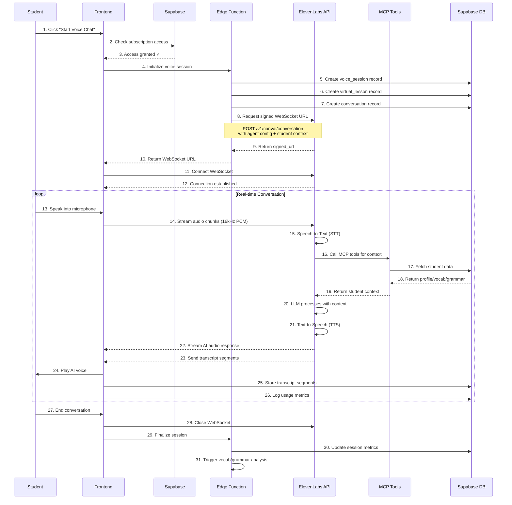

# AI Voice Interaction Flow - Detailed Architecture

## Overview
This document provides a comprehensive visual schema of how student speech flows through the ElevenLabs Conversational AI platform, gets processed by LLM with MCP tool integration, and is stored in Supabase for learning analytics.

---

## 1. End-to-End Voice Interaction Flow



---

## 2. Audio Processing Pipeline

```
┌─────────────────────────────────────────────────────────────────────────┐
│                         STUDENT DEVICE (Frontend)                        │
├─────────────────────────────────────────────────────────────────────────┤
│                                                                           │
│  [Microphone] ──────┐                                                    │
│                     │                                                     │
│                     ▼                                                     │
│              ┌──────────────┐                                            │
│              │ MediaStream  │  getUserMedia({ audio: true })            │
│              │  AudioContext│  Sample Rate: 16kHz                        │
│              └──────┬───────┘                                            │
│                     │                                                     │
│                     ▼                                                     │
│              ┌──────────────┐                                            │
│              │ScriptProcessor│ Process audio in 4096 sample chunks      │
│              │   (4096)     │                                            │
│              └──────┬───────┘                                            │
│                     │                                                     │
│                     ▼                                                     │
│              ┌──────────────┐                                            │
│              │ Base64 Encode│ Convert Float32Array to base64            │
│              └──────┬───────┘                                            │
│                     │                                                     │
│                     ▼                                                     │
│              ┌──────────────┐                                            │
│              │  WebSocket   │ Send: { type: "audio", data: base64 }     │
│              │  Connection  │                                            │
│              └──────┬───────┘                                            │
└─────────────────────┼─────────────────────────────────────────────────┘
                      │
                      │ Bidirectional Stream
                      │
┌─────────────────────▼─────────────────────────────────────────────────┐
│                      ELEVENLABS CONVERSATIONAL AI                       │
├─────────────────────────────────────────────────────────────────────────┤
│                                                                           │
│  [WebSocket Receive] ◄── { type: "audio", data: base64 }                │
│           │                                                               │
│           ▼                                                               │
│  ┌──────────────────┐                                                   │
│  │ Speech-to-Text   │  Deepgram STT                                     │
│  │   (Included)     │  Real-time transcription                          │
│  └────────┬─────────┘  Sub-100ms latency                                │
│           │                                                               │
│           ▼                                                               │
│  ┌──────────────────┐                                                   │
│  │ Transcript Text  │  "I want to practice job interview"               │
│  └────────┬─────────┘                                                   │
│           │                                                               │
│           ▼                                                               │
│  ┌──────────────────┐                                                   │
│  │  LLM Processing  │  GPT-4 Turbo                                      │
│  │  with MCP Tools  │  + Agent Instructions                             │
│  └────────┬─────────┘  + Student Context                                │
│           │                                                               │
│           ▼                                                               │
│  ┌──────────────────┐                                                   │
│  │  AI Response     │  "Great! Let's start. Tell me about yourself."    │
│  │     Text         │                                                    │
│  └────────┬─────────┘                                                   │
│           │                                                               │
│           ▼                                                               │
│  ┌──────────────────┐                                                   │
│  │ Text-to-Speech   │  ElevenLabs TTS                                   │
│  │   (Included)     │  Natural voice synthesis                          │
│  └────────┬─────────┘  Selected voice model                             │
│           │                                                               │
│           ▼                                                               │
│  [WebSocket Send] ──► { type: "audio", data: base64_audio }             │
│                    ──► { type: "transcript", speaker: "ai", text: "..." }│
│                                                                           │
└───────────────────────┬───────────────────────────────────────────────┘
                        │
                        │ Receive audio + transcripts
                        │
┌───────────────────────▼───────────────────────────────────────────────┐
│                    FRONTEND (Playback & Storage)                        │
├─────────────────────────────────────────────────────────────────────────┤
│                                                                           │
│  [Receive AI Audio] ─────┐                                              │
│                          │                                               │
│                          ▼                                               │
│                   ┌──────────────┐                                      │
│                   │ Decode Base64│                                      │
│                   └──────┬───────┘                                      │
│                          │                                               │
│                          ▼                                               │
│                   ┌──────────────┐                                      │
│                   │ Audio Buffer │                                      │
│                   └──────┬───────┘                                      │
│                          │                                               │
│                          ▼                                               │
│                   ┌──────────────┐                                      │
│                   │  Play Sound  │ Output to speakers                   │
│                   └──────────────┘                                      │
│                                                                           │
│  [Receive Transcript] ──┐                                               │
│                         │                                                │
│                         ▼                                                │
│                  ┌─────────────────┐                                    │
│                  │  Display in UI  │ Real-time transcript               │
│                  └────────┬────────┘                                    │
│                           │                                              │
│                           ▼                                              │
│                  ┌─────────────────┐                                    │
│                  │  Store in DB    │ Save to Supabase                   │
│                  └─────────────────┘                                    │
│                                                                           │
└─────────────────────────────────────────────────────────────────────────┘
```

---

## 3. MCP Tool Integration Flow

```
┌─────────────────────────────────────────────────────────────────────────┐
│                    ELEVENLABS AGENT CONFIGURATION                        │
│                    (Set during session initialization)                   │
├─────────────────────────────────────────────────────────────────────────┤
│                                                                           │
│  Agent Config:                                                           │
│  {                                                                        │
│    agent_id: "justtalk_english_tutor",                                  │
│    first_message: "Hi! I'm Alex, your English tutor...",               │
│                                                                           │
│    tools: [                                                              │
│      // MCP Tools available to the LLM                                  │
│      {                                                                    │
│        name: "get_student_profile",                                     │
│        description: "Get student's CEFR level, goals, interests",       │
│        parameters: { student_id: "uuid" }                               │
│      },                                                                   │
│      {                                                                    │
│        name: "get_student_vocabulary",                                  │
│        description: "Get recently learned words and mastery levels",    │
│        parameters: { student_id: "uuid", limit: 20 }                    │
│      },                                                                   │
│      {                                                                    │
│        name: "get_student_grammar_topics",                              │
│        description: "Get grammar concepts and weak areas",              │
│        parameters: { student_id: "uuid" }                               │
│      },                                                                   │
│      {                                                                    │
│        name: "get_recent_lessons",                                      │
│        description: "Get topics from recent human teacher lessons",     │
│        parameters: { student_id: "uuid", limit: 5 }                     │
│      },                                                                   │
│      {                                                                    │
│        name: "get_vocabulary_due_for_review",                           │
│        description: "Get words due for spaced repetition review",       │
│        parameters: { student_id: "uuid" }                               │
│      }                                                                    │
│    ],                                                                     │
│                                                                           │
│    custom_llm_extra_body: {                                             │
│      system_prompt: "You are Alex, an adaptive English teacher..."      │
│    }                                                                      │
│  }                                                                        │
│                                                                           │
└─────────────────────────────────────────────────────────────────────────┘

                              ┌─────┐
                              │ LLM │ (GPT-4 Turbo inside ElevenLabs)
                              └──┬──┘
                                 │
         ┌───────────────────────┼───────────────────────┐
         │                       │                       │
         │      Student says:    │                       │
         │  "I want to practice  │                       │
         │   job interviews"     │                       │
         │                       │                       │
         └───────────────────────┼───────────────────────┘
                                 │
                                 ▼
                    ┌────────────────────────┐
                    │  LLM decides to call   │
                    │  MCP tools for context │
                    └───────────┬────────────┘
                                │
                ┌───────────────┼───────────────┐
                │               │               │
                ▼               ▼               ▼
    ┌──────────────────┐ ┌────────────────┐ ┌──────────────────┐
    │get_student_profile│ │get_recent_lessons│ │get_student_vocab │
    └─────────┬────────┘ └────────┬───────┘ └────────┬─────────┘
              │                   │                  │
              │                   │                  │
              ▼                   ▼                  ▼
    ┌─────────────────────────────────────────────────────────┐
    │              SUPABASE EDGE FUNCTION                      │
    │           (mcp-tool-handler or integrated)               │
    └─────────────────────┬───────────────────────────────────┘
                          │
                          │ Execute database queries
                          │
                          ▼
    ┌─────────────────────────────────────────────────────────┐
    │                  SUPABASE DATABASE                       │
    ├─────────────────────────────────────────────────────────┤
    │                                                           │
    │  Query: profiles table                                   │
    │  SELECT cefr_level, learning_goals, interests,           │
    │         ai_correction_style, native_language             │
    │  FROM profiles WHERE id = $1                             │
    │                                                           │
    │  Query: lessons table                                    │
    │  SELECT title, topic, created_at                         │
    │  FROM lessons WHERE student_id = $1                      │
    │  ORDER BY created_at DESC LIMIT 5                        │
    │                                                           │
    │  Query: student_vocabulary table                         │
    │  SELECT word, mastery_level, last_reviewed_at            │
    │  FROM student_vocabulary WHERE student_id = $1           │
    │  ORDER BY last_reviewed_at DESC LIMIT 20                 │
    │                                                           │
    └────────────────────┬────────────────────────────────────┘
                         │
                         │ Return results
                         │
                         ▼
    ┌─────────────────────────────────────────────────────────┐
    │                  MCP TOOL RESPONSE                       │
    ├─────────────────────────────────────────────────────────┤
    │                                                           │
    │  get_student_profile() returns:                          │
    │  {                                                        │
    │    cefr_level: "B2",                                     │
    │    learning_goals: ["career_advancement", "interview"],  │
    │    interests: ["technology", "business"],                │
    │    correction_style: "balanced",                         │
    │    native_language: "Spanish"                            │
    │  }                                                        │
    │                                                           │
    │  get_recent_lessons() returns:                           │
    │  [                                                        │
    │    { title: "Business Email Writing", topic: "career" }, │
    │    { title: "Presentation Skills", topic: "career" }     │
    │  ]                                                        │
    │                                                           │
    │  get_student_vocabulary() returns:                       │
    │  [                                                        │
    │    { word: "proficiency", mastery: 0.7 },               │
    │    { word: "collaboration", mastery: 0.6 },             │
    │    { word: "innovative", mastery: 0.8 }                 │
    │  ]                                                        │
    │                                                           │
    └────────────────────┬────────────────────────────────────┘
                         │
                         │ Context injected into LLM prompt
                         │
                         ▼
    ┌─────────────────────────────────────────────────────────┐
    │                   LLM GENERATES RESPONSE                 │
    ├─────────────────────────────────────────────────────────┤
    │                                                           │
    │  Enhanced Prompt:                                        │
    │  ---                                                      │
    │  Student Context:                                        │
    │  - Level: B2 (Upper Intermediate)                        │
    │  - Goals: Career advancement, interview practice         │
    │  - Recent lessons: Business emails, presentations        │
    │  - Learning vocabulary: proficiency, collaboration       │
    │  - Correction style: Balanced (gentle but thorough)      │
    │  - Native language: Spanish (watch for Spanish errors)   │
    │                                                           │
    │  Student said: "I want to practice job interviews"       │
    │                                                           │
    │  Instructions:                                           │
    │  - Continue from recent business topics                  │
    │  - Incorporate vocabulary they're learning               │
    │  - Use B2-appropriate complexity                         │
    │  - Give balanced corrections (not too harsh)             │
    │  - Be aware of Spanish→English common mistakes           │
    │  ---                                                      │
    │                                                           │
    │  Generated Response:                                     │
    │  "Excellent! I see you've been working on business       │
    │   communication. Let's practice a job interview. I'll    │
    │   be the interviewer. Can you tell me about a time       │
    │   when you demonstrated strong collaboration skills      │
    │   on an innovative project? Remember to highlight your   │
    │   proficiency in your field."                            │
    │                                                           │
    │  [Uses vocabulary from their learning list]              │
    │  [Connects to recent lesson topics]                      │
    │  [B2-level question structure]                           │
    │                                                           │
    └──────────────────────────────────────────────────────────┘
```

---

## 4. Database Storage Schema

```
┌───────────────────────────────────────────────────────────────────────────┐
│                         SUPABASE DATABASE TABLES                          │
│                    (What gets stored during interaction)                  │
└───────────────────────────────────────────────────────────────────────────┘

┌─────────────────────────────────────────────────────────────────────────┐
│  TABLE: ai_chat_conversations                                            │
├─────────────────────────────────────────────────────────────────────────┤
│  id                  UUID PRIMARY KEY                                    │
│  session_id          UUID                                                │
│  user_id             UUID (references profiles)                          │
│  student_id          UUID (references profiles, same as user_id)         │
│  conversation_type   TEXT ('student_subscription')                       │
│  feature_name        TEXT ('ai_chat_subscription')                       │
│  is_voice_session    BOOLEAN (true for voice chats)                      │
│  voice_session_duration INTEGER (seconds)                                │
│  ai_voice_id         TEXT (ElevenLabs voice ID: 'rachel', 'adam')       │
│  title               TEXT ('Job Interview Practice', 'Travel English')   │
│  created_at          TIMESTAMPTZ                                         │
│  updated_at          TIMESTAMPTZ                                         │
├─────────────────────────────────────────────────────────────────────────┤
│  EXAMPLE ROW:                                                            │
│  {                                                                        │
│    id: "550e8400-e29b-41d4-a716-446655440000",                          │
│    session_id: "550e8400-e29b-41d4-a716-446655440001",                 │
│    user_id: "user-123",                                                  │
│    student_id: "user-123",                                               │
│    conversation_type: "student_subscription",                            │
│    feature_name: "ai_chat_subscription",                                 │
│    is_voice_session: true,                                               │
│    voice_session_duration: 1847,                                         │
│    ai_voice_id: "rachel",                                                │
│    title: "Job Interview Practice Session",                              │
│    created_at: "2025-12-02T10:30:00Z"                                   │
│  }                                                                        │
└─────────────────────────────────────────────────────────────────────────┘

┌─────────────────────────────────────────────────────────────────────────┐
│  TABLE: ai_voice_sessions                                                │
├─────────────────────────────────────────────────────────────────────────┤
│  id                          UUID PRIMARY KEY                            │
│  conversation_id             UUID (references ai_chat_conversations)     │
│  student_id                  UUID (references profiles)                  │
│  virtual_lesson_id           UUID (references lessons)                   │
│  total_duration_seconds      INTEGER                                     │
│  student_speaking_time_seconds INTEGER                                   │
│  ai_speaking_time_seconds    INTEGER                                     │
│  elevenlabs_character_count  INTEGER (for billing)                       │
│  elevenlabs_cost_cents       INTEGER                                     │
│  ai_voice_id                 TEXT                                        │
│  started_at                  TIMESTAMPTZ                                 │
│  ended_at                    TIMESTAMPTZ                                 │
│  transcription_complete      BOOLEAN                                     │
│  vocabulary_processed        BOOLEAN                                     │
│  grammar_processed           BOOLEAN                                     │
│  created_at                  TIMESTAMPTZ                                 │
│  updated_at                  TIMESTAMPTZ                                 │
├─────────────────────────────────────────────────────────────────────────┤
│  EXAMPLE ROW:                                                            │
│  {                                                                        │
│    id: "voice-session-456",                                              │
│    conversation_id: "550e8400-e29b-41d4-a716-446655440000",            │
│    student_id: "user-123",                                               │
│    virtual_lesson_id: "lesson-789",                                      │
│    total_duration_seconds: 1847,                                         │
│    student_speaking_time_seconds: 923,                                   │
│    ai_speaking_time_seconds: 924,                                        │
│    elevenlabs_character_count: 4250,                                     │
│    elevenlabs_cost_cents: 128,                                           │
│    ai_voice_id: "rachel",                                                │
│    started_at: "2025-12-02T10:30:00Z",                                  │
│    ended_at: "2025-12-02T11:00:47Z",                                    │
│    transcription_complete: true,                                         │
│    vocabulary_processed: true,                                           │
│    grammar_processed: true                                               │
│  }                                                                        │
└─────────────────────────────────────────────────────────────────────────┘

┌─────────────────────────────────────────────────────────────────────────┐
│  TABLE: lessons (Virtual Lesson for Transcription Storage)              │
├─────────────────────────────────────────────────────────────────────────┤
│  id               UUID PRIMARY KEY                                       │
│  teacher_id       UUID (NULL for AI sessions)                            │
│  student_id       UUID (references profiles)                             │
│  starts_at        TIMESTAMPTZ                                            │
│  ends_at          TIMESTAMPTZ                                            │
│  status           TEXT ('completed')                                     │
│  is_ai_session    BOOLEAN (true)                                         │
│  title            TEXT ('AI Voice Practice: Job Interviews')             │
│  notes            TEXT ('Virtual lesson for AI transcription storage')   │
├─────────────────────────────────────────────────────────────────────────┤
│  PURPOSE: Reuse existing transcription infrastructure                    │
│  EXAMPLE ROW:                                                            │
│  {                                                                        │
│    id: "lesson-789",                                                     │
│    teacher_id: NULL,                                                     │
│    student_id: "user-123",                                               │
│    starts_at: "2025-12-02T10:30:00Z",                                   │
│    ends_at: "2025-12-02T11:00:47Z",                                     │
│    status: "completed",                                                  │
│    is_ai_session: true,                                                  │
│    title: "AI Voice Practice: Job Interviews"                            │
│  }                                                                        │
└─────────────────────────────────────────────────────────────────────────┘

┌─────────────────────────────────────────────────────────────────────────┐
│  TABLE: lesson_transcription_segments (Real-time Storage)               │
├─────────────────────────────────────────────────────────────────────────┤
│  id                UUID PRIMARY KEY                                      │
│  lesson_id         UUID (references lessons.id, virtual lesson)          │
│  speaker_id        UUID (student or NULL for AI)                         │
│  speaker_role      TEXT ('student' or 'ai_teacher')                      │
│  transcript        TEXT (the actual words spoken)                        │
│  start_time        DECIMAL (seconds from session start)                  │
│  end_time          DECIMAL                                               │
│  duration          DECIMAL                                               │
│  audio_file_path   TEXT (Supabase Storage path)                          │
│  created_at        TIMESTAMPTZ                                           │
├─────────────────────────────────────────────────────────────────────────┤
│  STORED IN REAL-TIME: As ElevenLabs sends transcript events              │
│                                                                           │
│  EXAMPLE ROWS:                                                           │
│                                                                           │
│  Row 1 (Student speaks):                                                 │
│  {                                                                        │
│    id: "segment-001",                                                    │
│    lesson_id: "lesson-789",                                              │
│    speaker_id: "user-123",                                               │
│    speaker_role: "student",                                              │
│    transcript: "I want to practice job interviews",                      │
│    start_time: 5.2,                                                      │
│    end_time: 7.8,                                                        │
│    duration: 2.6,                                                        │
│    audio_file_path: "user-123/lesson-789/segment-001.mp3",             │
│    created_at: "2025-12-02T10:30:07Z"                                   │
│  }                                                                        │
│                                                                           │
│  Row 2 (AI responds):                                                    │
│  {                                                                        │
│    id: "segment-002",                                                    │
│    lesson_id: "lesson-789",                                              │
│    speaker_id: NULL,                                                     │
│    speaker_role: "ai_teacher",                                           │
│    transcript: "Excellent! I see you've been working on business...",   │
│    start_time: 8.1,                                                      │
│    end_time: 15.4,                                                       │
│    duration: 7.3,                                                        │
│    audio_file_path: "user-123/lesson-789/segment-002.mp3",             │
│    created_at: "2025-12-02T10:30:15Z"                                   │
│  }                                                                        │
│                                                                           │
│  Row 3 (Student responds):                                               │
│  {                                                                        │
│    id: "segment-003",                                                    │
│    lesson_id: "lesson-789",                                              │
│    speaker_id: "user-123",                                               │
│    speaker_role: "student",                                              │
│    transcript: "Yes, in my last project I work with team of five...",   │
│    start_time: 16.2,                                                     │
│    end_time: 22.8,                                                       │
│    duration: 6.6,                                                        │
│    audio_file_path: "user-123/lesson-789/segment-003.mp3",             │
│    created_at: "2025-12-02T10:30:22Z"                                   │
│  }                                                                        │
│                                                                           │
│  [Grammar error detected: "I work" → "I worked"]                         │
│  [Will be processed by grammar analysis after session]                   │
│                                                                           │
└─────────────────────────────────────────────────────────────────────────┘

┌─────────────────────────────────────────────────────────────────────────┐
│  TABLE: ai_chat_messages                                                 │
├─────────────────────────────────────────────────────────────────────────┤
│  id                UUID PRIMARY KEY                                      │
│  conversation_id   UUID (references ai_chat_conversations)               │
│  role              TEXT ('user', 'assistant', 'system')                  │
│  content           TEXT (message text)                                   │
│  tokens_used       INTEGER                                               │
│  audio_url         TEXT (Supabase Storage URL for voice messages)        │
│  created_at        TIMESTAMPTZ                                           │
├─────────────────────────────────────────────────────────────────────────┤
│  EXAMPLE ROWS:                                                           │
│                                                                           │
│  {                                                                        │
│    id: "msg-001",                                                        │
│    conversation_id: "550e8400-e29b-41d4-a716-446655440000",            │
│    role: "user",                                                         │
│    content: "I want to practice job interviews",                         │
│    tokens_used: 8,                                                       │
│    audio_url: "voice-sessions/user-123/msg-001.mp3",                    │
│    created_at: "2025-12-02T10:30:07Z"                                   │
│  },                                                                       │
│  {                                                                        │
│    id: "msg-002",                                                        │
│    conversation_id: "550e8400-e29b-41d4-a716-446655440000",            │
│    role: "assistant",                                                    │
│    content: "Excellent! I see you've been working on business...",      │
│    tokens_used: 45,                                                      │
│    audio_url: "voice-sessions/user-123/msg-002.mp3",                    │
│    created_at: "2025-12-02T10:30:15Z"                                   │
│  }                                                                        │
└─────────────────────────────────────────────────────────────────────────┘

┌─────────────────────────────────────────────────────────────────────────┐
│  TABLE: ai_subscription_usage_log                                        │
├─────────────────────────────────────────────────────────────────────────┤
│  id                      UUID PRIMARY KEY                                │
│  subscription_id         UUID (references ai_subscriptions)              │
│  student_id              UUID                                            │
│  message_id              UUID (references ai_chat_messages)              │
│  conversation_id         UUID                                            │
│  tokens_used             INTEGER                                         │
│  cost_cents              INTEGER                                         │
│  is_voice_message        BOOLEAN                                         │
│  elevenlabs_characters   INTEGER                                         │
│  created_at              TIMESTAMPTZ                                     │
│  billing_period_start    TIMESTAMPTZ                                     │
│  billing_period_end      TIMESTAMPTZ                                     │
├─────────────────────────────────────────────────────────────────────────┤
│  EXAMPLE ROW:                                                            │
│  {                                                                        │
│    id: "usage-001",                                                      │
│    subscription_id: "sub-premium-123",                                   │
│    student_id: "user-123",                                               │
│    message_id: "msg-002",                                                │
│    conversation_id: "550e8400-e29b-41d4-a716-446655440000",            │
│    tokens_used: 45,                                                      │
│    cost_cents: 6,                                                        │
│    is_voice_message: true,                                               │
│    elevenlabs_characters: 85,                                            │
│    created_at: "2025-12-02T10:30:15Z",                                  │
│    billing_period_start: "2025-12-01T00:00:00Z",                        │
│    billing_period_end: "2025-12-31T23:59:59Z"                           │
│  }                                                                        │
└─────────────────────────────────────────────────────────────────────────┘
```

---

## 5. Post-Session Analysis Flow

```
┌─────────────────────────────────────────────────────────────────────────┐
│                    AFTER VOICE SESSION ENDS                              │
└─────────────────────────────────────────────────────────────────────────┘

Frontend: endVoiceSession()
    │
    ▼
┌──────────────────────────────────────────┐
│ 1. Close WebSocket connection            │
│ 2. Update ai_voice_sessions:             │
│    - ended_at = NOW()                    │
│    - total_duration_seconds = X          │
│    - elevenlabs_character_count = Y      │
│ 3. Update virtual lesson:                │
│    - status = 'completed'                │
│    - ends_at = NOW()                     │
└────────────────┬─────────────────────────┘
                 │
                 ▼
┌────────────────────────────────────────────────────────────┐
│  TRIGGER: Edge Function "process-completed-lessons"        │
│  Input: { lessonId: "lesson-789" }                        │
└────────────────┬───────────────────────────────────────────┘
                 │
                 ▼
┌────────────────────────────────────────────────────────────┐
│  Step 1: Fetch all transcription segments                 │
│  Query: SELECT * FROM lesson_transcription_segments       │
│         WHERE lesson_id = 'lesson-789'                    │
│         AND speaker_role = 'student'                      │
│         ORDER BY start_time                               │
└────────────────┬───────────────────────────────────────────┘
                 │
                 ▼
         Student transcripts:
         - "I want to practice job interviews"
         - "Yes, in my last project I work with team of five..."
         - "We create new feature for mobile app..."
                 │
                 ▼
┌────────────────────────────────────────────────────────────┐
│  Step 2: Vocabulary Extraction                            │
│  - Use OpenAI GPT-4 to analyze student speech            │
│  - Extract new/interesting words                         │
│  - Determine if student already knows them               │
└────────────────┬───────────────────────────────────────────┘
                 │
                 ▼
┌────────────────────────────────────────────────────────────┐
│  LLM Prompt:                                               │
│  "Analyze this B2 student's speech. Extract vocabulary    │
│   that would be useful for them to learn or review.       │
│                                                             │
│   Transcripts:                                             │
│   - I want to practice job interviews                      │
│   - Yes, in my last project I work with team of five...   │
│   - We create new feature for mobile app...               │
│                                                             │
│   Return JSON:                                             │
│   {                                                         │
│     'new_words': ['practice', 'feature'],                 │
│     'grammar_errors': [                                    │
│       {                                                     │
│         'error': 'I work',                                 │
│         'correct': 'I worked',                             │
│         'explanation': 'Past tense needed'                 │
│       }                                                     │
│     ]                                                       │
│   }"                                                        │
└────────────────┬───────────────────────────────────────────┘
                 │
                 ▼
┌────────────────────────────────────────────────────────────┐
│  Step 3: Store Vocabulary                                 │
│  INSERT INTO student_vocabulary                           │
│  (student_id, word, context, source_lesson_id, ...)       │
│  VALUES                                                    │
│    ('user-123', 'practice', 'job interviews', ...)        │
│    ('user-123', 'feature', 'mobile app', ...)             │
│                                                             │
│  Step 4: Schedule Spaced Repetition                       │
│  INSERT INTO vocabulary_reviews                           │
│  (student_id, word_id, next_review_at, ...)               │
│  VALUES                                                    │
│    ('user-123', 'word-001', NOW() + INTERVAL '1 day')     │
│    ('user-123', 'word-002', NOW() + INTERVAL '1 day')     │
└────────────────┬───────────────────────────────────────────┘
                 │
                 ▼
┌────────────────────────────────────────────────────────────┐
│  Step 5: Store Grammar Topics                             │
│  INSERT INTO student_grammar_topics                       │
│  (student_id, topic, error_count, ...)                    │
│  VALUES                                                    │
│    ('user-123', 'past_tense', 1, ...),                    │
│    ('user-123', 'subject_verb_agreement', 1, ...)         │
│                                                             │
│  Update existing if already tracked                        │
└────────────────┬───────────────────────────────────────────┘
                 │
                 ▼
┌────────────────────────────────────────────────────────────┐
│  Step 6: Update Student Progress                          │
│  UPDATE profiles                                           │
│  SET total_speaking_minutes = total_speaking_minutes + 30, │
│      vocabulary_count = vocabulary_count + 2,              │
│      last_practice_at = NOW()                              │
│  WHERE id = 'user-123'                                     │
└────────────────┬───────────────────────────────────────────┘
                 │
                 ▼
┌────────────────────────────────────────────────────────────┐
│  Step 7: Mark Session as Processed                        │
│  UPDATE ai_voice_sessions                                 │
│  SET transcription_complete = true,                       │
│      vocabulary_processed = true,                         │
│      grammar_processed = true                             │
│  WHERE id = 'voice-session-456'                           │
└────────────────┬───────────────────────────────────────────┘
                 │
                 ▼
┌────────────────────────────────────────────────────────────┐
│  Result: Student now has:                                  │
│  ✓ 2 new vocabulary words in their dictionary             │
│  ✓ Spaced repetition reviews scheduled                    │
│  ✓ Grammar weaknesses identified                          │
│  ✓ Progress metrics updated                               │
│  ✓ Session available in history                           │
└────────────────────────────────────────────────────────────┘
```

---

## 6. MCP Tool Implementation Example

```typescript
// Backend: Supabase Edge Function
// File: supabase/functions/mcp-tool-handler/index.ts

import { createClient } from '@supabase/supabase-js'

export async function handleMCPToolCall(
  toolName: string,
  parameters: any
): Promise<any> {
  const supabase = createClient(
    Deno.env.get('SUPABASE_URL')!,
    Deno.env.get('SUPABASE_SERVICE_ROLE_KEY')!
  )

  switch (toolName) {
    case 'get_student_profile':
      return await getStudentProfile(supabase, parameters.student_id)
    
    case 'get_student_vocabulary':
      return await getStudentVocabulary(
        supabase,
        parameters.student_id,
        parameters.limit || 20
      )
    
    case 'get_student_grammar_topics':
      return await getStudentGrammarTopics(supabase, parameters.student_id)
    
    case 'get_recent_lessons':
      return await getRecentLessons(
        supabase,
        parameters.student_id,
        parameters.limit || 5
      )
    
    case 'get_vocabulary_due_for_review':
      return await getVocabularyDueForReview(supabase, parameters.student_id)
    
    default:
      throw new Error(`Unknown MCP tool: ${toolName}`)
  }
}

async function getStudentProfile(supabase: any, studentId: string) {
  const { data, error } = await supabase
    .from('profiles')
    .select('cefr_level, learning_goals, interests, ai_correction_style, native_language')
    .eq('id', studentId)
    .single()
  
  if (error) throw error
  
  return {
    cefr_level: data.cefr_level,
    learning_goals: data.learning_goals || [],
    interests: data.interests?.split(',') || [],
    correction_style: data.ai_correction_style || 'balanced',
    native_language: data.native_language
  }
}

async function getStudentVocabulary(
  supabase: any,
  studentId: string,
  limit: number
) {
  const { data, error } = await supabase
    .from('student_vocabulary')
    .select('word, mastery_level, last_reviewed_at, times_reviewed')
    .eq('student_id', studentId)
    .order('last_reviewed_at', { ascending: false })
    .limit(limit)
  
  if (error) throw error
  
  return data.map(item => ({
    word: item.word,
    mastery: item.mastery_level,
    last_reviewed: item.last_reviewed_at,
    review_count: item.times_reviewed
  }))
}

async function getStudentGrammarTopics(supabase: any, studentId: string) {
  const { data, error } = await supabase
    .from('student_grammar_topics')
    .select('topic, mastery_level, error_count, last_practiced_at')
    .eq('student_id', studentId)
    .order('mastery_level', { ascending: true })
    .limit(10)
  
  if (error) throw error
  
  return {
    weak_areas: data.filter(t => t.mastery_level < 0.5).map(t => t.topic),
    strong_areas: data.filter(t => t.mastery_level >= 0.8).map(t => t.topic),
    needs_practice: data.filter(t => t.error_count > 3).map(t => ({
      topic: t.topic,
      error_count: t.error_count
    }))
  }
}

async function getRecentLessons(
  supabase: any,
  studentId: string,
  limit: number
) {
  const { data, error } = await supabase
    .from('lessons')
    .select('title, topic, created_at, teacher_id')
    .eq('student_id', studentId)
    .eq('status', 'completed')
    .order('created_at', { ascending: false })
    .limit(limit)
  
  if (error) throw error
  
  return data.map(lesson => ({
    title: lesson.title,
    topic: lesson.topic,
    date: lesson.created_at,
    was_with_human_teacher: lesson.teacher_id !== null
  }))
}

async function getVocabularyDueForReview(supabase: any, studentId: string) {
  const { data, error } = await supabase
    .from('vocabulary_reviews')
    .select('word, next_review_at, review_count')
    .eq('student_id', studentId)
    .lte('next_review_at', new Date().toISOString())
    .order('next_review_at', { ascending: true })
    .limit(10)
  
  if (error) throw error
  
  return data.map(review => ({
    word: review.word,
    due_date: review.next_review_at,
    times_reviewed: review.review_count
  }))
}
```

---

## 7. Complete Data Flow Summary

```
┌──────────────┐
│   STUDENT    │ Speaks: "I want to practice job interviews"
└──────┬───────┘
       │
       │ Audio Stream (16kHz PCM)
       │
       ▼
┌──────────────────────────────────────────────────────────────┐
│              ELEVENLABS CONVERSATIONAL AI                     │
│                                                                │
│  ┌──────────────┐   ┌──────────────┐   ┌──────────────┐     │
│  │     STT      │──▶│  LLM + MCP   │──▶│     TTS      │     │
│  │  (Deepgram)  │   │  (GPT-4)     │   │(ElevenLabs)  │     │
│  └──────────────┘   └──────┬───────┘   └──────────────┘     │
│                             │                                 │
│                             │ Calls MCP Tools                 │
│                             ▼                                 │
│                   ┌─────────────────────┐                    │
│                   │ get_student_profile │                    │
│                   │ get_recent_lessons  │                    │
│                   │ get_student_vocab   │                    │
│                   └─────────┬───────────┘                    │
└─────────────────────────────┼───────────────────────────────┘
                              │
                              ▼
                   ┌─────────────────────┐
                   │  SUPABASE DATABASE  │
                   ├─────────────────────┤
                   │ • profiles          │
                   │ • lessons           │
                   │ • student_vocabulary│
                   │ • grammar_topics    │
                   └──────────┬──────────┘
                              │
                              │ Returns Context
                              │
        ┌─────────────────────┴─────────────────────┐
        │                                             │
        ▼                                             ▼
┌───────────────┐                           ┌────────────────┐
│ LLM generates │                           │ Response sent  │
│ personalized  │                           │ back to student│
│   response    │                           │  as audio      │
└───────┬───────┘                           └────────┬───────┘
        │                                             │
        │                                             │
        └─────────────────┬───────────────────────────┘
                          │
                          ▼
              ┌───────────────────────┐
              │   SUPABASE STORAGE    │
              ├───────────────────────┤
              │ REAL-TIME (during):   │
              │ • ai_chat_conversations│
              │ • ai_chat_messages    │
              │ • transcription_segments│
              │ • subscription_usage_log│
              │                       │
              │ POST-SESSION (async): │
              │ • student_vocabulary  │
              │ • vocabulary_reviews  │
              │ • grammar_topics      │
              │ • student progress    │
              └───────────────────────┘
```

---

## 8. Key Optimization Points

### Real-Time Optimizations

1. **Streaming Audio Processing**
   - Audio chunks sent every 4096 samples (~256ms at 16kHz)
   - No buffering delays
   - Sub-100ms latency with ElevenLabs

2. **Lazy Storage**
   - Transcripts stored as they arrive (no waiting for full session)
   - Audio segments saved incrementally
   - Usage logged immediately for billing accuracy

3. **MCP Tool Caching**
   - Student profile cached for session duration
   - Vocabulary/grammar fetched once per conversation
   - Recent lessons cached (rarely changes during conversation)

### Post-Session Optimizations

1. **Async Processing**
   - Vocabulary extraction happens after session ends
   - Grammar analysis runs in background
   - Student doesn't wait for processing

2. **Batch Operations**
   - Multiple vocabulary words inserted in single query
   - Grammar topics upserted in batch
   - Spaced repetition reviews scheduled together

3. **Deferred Analytics**
   - Progress metrics updated after processing
   - Reports generated on-demand
   - Historical data aggregated periodically

---

## 9. Cost Tracking Flow

```
Every Message Exchange:
┌────────────────────────────────────────────┐
│  Student speaks (30 sec)                   │
│  → ElevenLabs STT (included)               │
│  → LLM processes (~150 tokens)             │
│  → ElevenLabs TTS (~200 characters)        │
│  TOTAL COST: ~$0.06                        │
└────────────┬───────────────────────────────┘
             │
             ▼
┌────────────────────────────────────────────┐
│  INSERT INTO ai_subscription_usage_log     │
│  {                                          │
│    subscription_id: "sub-123",             │
│    tokens_used: 150,                       │
│    cost_cents: 6,                          │
│    is_voice_message: true,                 │
│    elevenlabs_characters: 200,             │
│    billing_period_start: "2025-12-01",     │
│    billing_period_end: "2025-12-31"        │
│  }                                          │
└────────────┬───────────────────────────────┘
             │
             ▼
┌────────────────────────────────────────────┐
│  UPDATE ai_subscriptions                   │
│  SET messages_used_this_period =           │
│      messages_used_this_period + 1         │
│  WHERE id = "sub-123"                      │
└────────────────────────────────────────────┘

Check Before Each Message:
┌────────────────────────────────────────────┐
│  SELECT check_ai_subscription_access(...)  │
│  → Returns:                                 │
│    {                                        │
│      can_send_message: true/false,         │
│      messages_remaining: 237,              │
│      reset_date: "2025-12-31"              │
│    }                                        │
└────────────────────────────────────────────┘
```

---

## Conclusion

This architecture provides:

✅ **Real-time voice interaction** with sub-100ms latency  
✅ **Personalized teaching** via MCP tool integration  
✅ **Automatic learning analytics** via transcription processing  
✅ **Scalable storage** reusing existing infrastructure  
✅ **Cost-effective** with usage tracking and limits  
✅ **Rich student insights** from vocabulary and grammar analysis  

The system creates a seamless flow from spoken words to analyzed learning data, all while maintaining natural conversation quality and teaching effectiveness.
